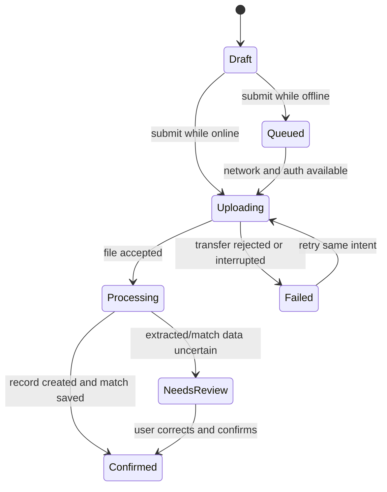

# Receipt Capture and Matching

A React Native (Expo) implementation of the receipt-capture brief: an employee with unreliable
connectivity photographs or picks a receipt, records the expense metadata, and matches it against a
seeded card transaction — without the app ever lying to them about whether the server actually has it.

Design rationale, assumptions, tradeoffs, deliberate omissions and next steps live in
**[DECISIONS.md](DECISIONS.md)**.

---

## What was tested, and on what

| | |
| --- | --- |
| **Primary review target** | iOS Simulator — **iPhone 15 Pro, iOS 17.0**, via Expo Go (SDK 57) |
| **Also verified** | Android emulator — **Pixel 8 Pro, Android 17**, via Expo Go. Launches and renders; 1848 modules |
| **Host** | macOS 26.6 (Darwin 25.6), Xcode 27.0, Node 22.23.1, npm 10.9.8 |
| **Verified on the simulator** | App launches and renders; sign-in screen shows the seeded users and companies; deep-link routing works; Metro bundles 1696 modules; **no runtime errors** |
| **Verified by test, not by hand** | The five demo steps below. Each maps to end-to-end tests against the real engine, store, session and server (see [Testing](#testing)). |
| **Verified** | 1057 automated tests; `tsc --noEmit` clean under `strict`; ESLint clean |
| **Not verified on device** | A physical handset of either platform |
| **Simulated, not real** | The backend. There is no network call anywhere in `src/` — the "server" is an in-process object |
| **Untested in Expo Go** | Notification *delivery*. Expo Go dropped push support in SDK 53 — on Android the import itself throws, which crashed the app until it was guarded. The policy and route validation are unit-tested; delivery needs a development build |
| **Needs hardware** | Barcode *scanning* through the camera. Barcode *decoding* is pure and has 96 tests |

No Apple or Google developer account, signing credentials, or physical device is required. No
signing keys, provisioning profiles, tokens or service secrets are committed — there are none.

### Prerequisites

Node 20+ and npm. Then either path:

- **iOS** — Xcode with an iOS 17 simulator runtime.
- **Android** — Android Studio with an emulator image (verified on a Pixel 8 Pro, Android 17).

Nothing else: no backend to start, no `.env`, no API key, no base URL.

Notification *delivery* does not work under Expo Go on either platform. Use `npx expo run:ios` or
`npx expo run:android` for that.

### Synthetic demo data

All seeded, all fake, all committed. Sign-in is a picker — there are no passwords.

| User | Member of |
| --- | --- |
| Dana Reyes | Northwind **and** Acme |
| Kim Alvarez | Northwind only |
| Sam Okafor | Acme only |

The membership is uneven on purpose: it makes the authorization refusal demonstrable rather than
theoretical. Each company seeds several deliberately close-but-not-identical transactions so
matching decisions are visible.

### Permissions the app asks for

Camera (photographing a receipt, and scanning a barcode), photo library (choosing an existing
image), and notifications. Each is requested at the point of use, never at launch, and every denial
path renders a specific message rather than a dead button.

## Quick start

```bash
npm install
```

```bash
npm start
```

Then press `i` for the iOS simulator, `a` for Android, or `w` for web. Run the tests with:

```bash
npm test
```

```bash
npm run typecheck
```

There is no backend to configure. The server is a deterministic in-process fake
([`src/server/fake-server.ts`](src/server/fake-server.ts)) with a full failure-injection surface,
driven from the app's **Session & simulation** screen.

### The five-minute demo path

Each step demonstrates one thing the brief asks for. Steps 2-5 are the ones worth watching.

1. **Authorization is server-side** (~40s). On the sign-in screen, press **Try Acme Corporation
   (not a member)** under *Kim Alvarez*. The button is deliberately enabled — hiding it would make
   the client the authority. The server refuses with `NOT_A_MEMBER`. Now sign in as **Dana Reyes →
   Northwind Traders**, which is allowed.

2. **Local and remote state are different** (~60s). Settings → **Offline**. Capture a receipt (any
   photo), fill in vendor / amount / date, **Save and queue**. On the list the row shows two
   columns: *Queued* on this device, **Not received** on the server. Nothing has reached a server
   and the app says so. Go back **Online** and pull to refresh — only now does the server column
   read *Confirmed*.

3. **A retry cannot duplicate** (~60s). Settings → **Inject a failure → Lost success response**.
   Capture and submit: it fails, and the receipt stays unconfirmed. Set the failure back to
   **None** and press **Try again** on the same receipt. You get *"Already on the server"* — the
   server recognised the idempotency key and returned the original record. One receipt, not two.

4. **A queued receipt cannot cross companies** (~60s). Go **Offline**, queue a receipt under
   Northwind, then Settings → **Switch to Acme Corporation**. The queued receipt is gone from the
   list and cannot be sent — it belongs to Northwind. Switch back and it uploads.

5. **Extraction never overwrites a human** (~60s). After attaching a photo you get a card marked
   **Simulated extraction** — those values come from the draft's id, not the image, and the card says
   so. Press **Use these**, then edit one of the fields it filled. Now open **Scan barcode or QR**:
   the "Applied" list reports *kept your own entry* for what you edited, and fills only what you left
   alone. A value you did not touch is still improvable; one you edited is not.

Steps 1-4 need no camera. Step 5 works in the simulator if you drag a QR image into it, and is the
only step that benefits from a real device.

## What this platform proves, and what it does not

**What Expo + React Native genuinely demonstrates here**

- Real durable local persistence across app kill (SQLite via `expo-sqlite`), which is what makes
  the offline queue meaningful rather than decorative.
- Real OS-level secret storage (`expo-secure-store` → iOS Keychain / Android Keystore), which is a
  genuinely different security posture from `AsyncStorage`.
- Real permission flows and real camera/document picking on a device or simulator.
- The state machine, idempotency, and tenancy rules are plain TypeScript and are therefore
  exercised by the test suite exactly as they run in the app.

**What it does not prove**

- **No real network.** The "server" is an in-process object. Nothing here proves behaviour against
  TLS, real latency, proxies, captive portals, or an actual HTTP stack. What it *does* prove is that
  the client's state machine responds correctly to each *class* of outcome, which is the part a
  reviewer can actually interrogate.
- **No true background upload.** Uploads run while the app is alive. Real
  `URLSession`/`WorkManager` background transfer is listed under Scope as not implemented.
- **Web is a degraded preview.** There is no native SQLite or Keychain in the browser, so the app
  falls back to in-memory stores — and *says so in a banner* rather than pretending to be durable.
- **No OCR, at all.** `extractFromReceipt` takes a *storage key string* and never sees a pixel. The
  values it produces are generated from the draft's id, so the same draft always reads the same way
  and a real receipt reads as nonsense. The brief says no real provider is required and that a
  deterministic fake is more discussable than a fragile external one, which is why it is built this
  way — but the UI has to be honest about it, so the capture screen labels the values **Simulated
  extraction** and makes you accept them rather than filling the form behind your back. Wiring a
  real provider means replacing one pure function whose signature would become
  `(bytes) => OcrResult`.

---

## Architecture

**Ports and adapters (hexagonal), with a functional core and an imperative shell.** Not MVVM —
there are no ViewModels, and no two-way binding. The layering is what earns its keep here, so it is
worth naming precisely:

- **Functional core.** `src/domain/` is pure: no React, no Expo, no I/O, and no clock or randomness
  of its own — every time- or randomness-dependent function takes it as a parameter. This is where
  the money rules, calendar arithmetic, state machine, provenance ladder and matching policy live,
  and it is why they can be tested as plain functions and mutation-audited cheaply.
- **Ports.** `ReceiptStore` and `SecretStore` are interfaces the core and the sync layer depend on.
  Neither names a technology.
- **Adapters.** `SQLiteReceiptStore` / `InMemoryReceiptStore`, and `ExpoSecretStore` /
  `InMemorySecretStore`. The in-memory pair are not test doubles bolted on afterwards — they are
  full implementations of the same contract, which is what lets the tenancy rules be verified
  without a device. `FakeServer` is an adapter in the same sense, and a real HTTP client would be
  another.
- **Application layer.** `SyncEngine` orchestrates the ports and is where the runtime invariants are
  enforced. It depends on interfaces only, which is why swapping the fake server for a real API
  would not touch it.
- **Imperative shell.** `src/ui/` and `src/app/` — React function components with unidirectional
  data flow through a single context that exposes state plus explicit actions. Deliberately thin;
  any logic worth testing has been pushed inward.

The dependency direction is strictly inward: UI → sync → data/server → domain. Nothing in the domain
knows that React, Expo, SQLite or a server exists.

| Path | Responsibility |
| --- | --- |
| [`src/domain/types.ts`](src/domain/types.ts) | The contract. Money, date semantics, the seven states, field provenance. |
| [`src/domain/state-machine.ts`](src/domain/state-machine.ts) | The brief's diagram, table-driven. Local events structurally cannot produce server states. |
| [`src/domain/money.ts`](src/domain/money.ts) | Integer minor units, per-currency exponents, string-based parsing (no floats). |
| [`src/domain/dates.ts`](src/domain/dates.ts) | `DateOnly` vs `Instant`, civil-date arithmetic, leap years. |
| [`src/domain/ids.ts`](src/domain/ids.ts) | Idempotency keys, submission fingerprints, rotation policy. |
| [`src/domain/validation.ts`](src/domain/validation.ts) | Untrusted-file checks by magic bytes; the production quarantine boundary. |
| [`src/domain/matching.ts`](src/domain/matching.ts) | Company-scoped candidate scoring and the one-receipt-per-transaction rule. |
| [`src/domain/confidence.ts`](src/domain/confidence.ts) | Confidence bands, generated caveats, auto-selection and ambiguity policy. |
| [`src/domain/barcode.ts`](src/domain/barcode.ts) | GS1-128 and fiscal-QR decoding. Pure; no camera dependency. |
| [`src/domain/extraction.ts`](src/domain/extraction.ts) | The only door through which an extraction may touch a draft. |
| [`src/notify/policy.ts`](src/notify/policy.ts) | Whether a transition is worth a notification, and what it may say. |
| [`src/notify/notifier.ts`](src/notify/notifier.ts) | The thin native shell around that policy. |
| [`src/ui/image-edit.ts`](src/ui/image-edit.ts) | Crop geometry and the re-encode pipeline. |
| [`src/data/store.ts`](src/data/store.ts) | The persistence interface — company-scoped *by signature*. |
| [`src/data/sqlite-store.ts`](src/data/sqlite-store.ts) · [`db.ts`](src/data/db.ts) | SQLite schema, migrations, row mapping. |
| [`src/data/session.ts`](src/data/session.ts) | Keychain-backed session, company switch, token rules. |
| [`src/server/`](src/server) | Deterministic fake backend, fake OCR, seed data. |
| [`src/sync/sync-engine.ts`](src/sync/sync-engine.ts) | Drains the queue. Where the invariants are enforced at runtime. |
| [`src/ui/`](src/ui) · [`src/app/`](src/app) | Screens and presentation. Thin on purpose. |

### The state machine



`Draft`, `Queued`, `Uploading` and `Failed` are **local**. `Processing`, `NeedsReview` and
`Confirmed` are **server** states, and the only function that can produce them —
`applyServerEvent()` — takes a server receipt id as a required argument and throws without one.
There is no code path that writes `state: 'confirmed'` from a local decision.

---

## The non-negotiable behaviors

| Requirement | Where it lives | How to see it |
| --- | --- | --- |
| Local and remote state are visibly different | [`src/ui/receipt-status.ts`](src/ui/receipt-status.ts) derives two independent columns; the server column reads `serverReceiptId`, never `state` | Every row and the detail screen show **On this device** and **On the server** side by side |
| Retrying does not duplicate | Stable `idempotencyKey` per draft + server dedupe on `(companyId, idempotencyKey)` | Inject *Lost success response*, then retry |
| Company switch cannot upload under the wrong company | Store is scoped by signature; `getTokenForCompany()` refuses a mismatch; server returns `COMPANY_MISMATCH` independently | Queue offline, switch company, try to sync |
| Explicit money/date semantics | Integer minor units + ISO-4217 exponent; `DateOnly` and `Instant` are separate types | Enter `1.999` in USD — rejected, not silently rounded. Pick JPY — no decimals; pick BHD — three |
| Files are untrusted | [`validation.ts`](src/domain/validation.ts) sniffs magic bytes; the declared MIME type is a hint that loses when they disagree | See `PRODUCTION_QUARANTINE_BOUNDARY` in that file |
| Secrets are not in plaintext storage | `expo-secure-store` only; the token never enters SQLite and `getPublicSession()` cannot leak it | `signOut()` empties the secret store |
| Authorization is server-side | `issueToken` refuses a company the user is not a member of; every later guard compares against the *token's* company | Sign-in screen: "Try Acme (not a member)" as Kim |

---

## Edge cases

Each of the brief's six cases is handled and, more importantly, **triggerable on demand** from
Settings — a failure path you cannot reproduce is one nobody has tested.

**1. Upload succeeds but the success response is lost.**
The fake server commits the record and *then* returns `TRANSFER_INTERRUPTED`, which is the only
honest model. The client cannot distinguish this from a real interruption, so it does the only safe
thing: retries with the same idempotency key. The server recognises the key and returns the original
receipt with `deduped: true`. The UI says "Already on the server". One record, one match.

**2. Auth expires while a background upload is running.**
The token is re-checked immediately before the request, not when the pass began. If it has lapsed,
the receipt is parked back in the queue with an explanatory message — never marked failed-forever,
never marked confirmed. `syncAll()` stops the whole pass on `AUTH_EXPIRED` rather than generating N
identical failures.

**3. App killed after queueing, relaunched under a different company.**
`companyId` is stamped on the draft at capture time and never rewritten. On relaunch under another
company the draft is invisible to every store query, and the sync engine skips it with
`COMPANY_CHANGED`. The detail screen explains *why* rather than showing an empty state. Switching
back makes it submittable again.

**4. A HEIC image is too large or unsupported.**
Rejected client-side by size and magic bytes before it ever enters the queue, and independently by
the server. Both rejections carry `retryable: false`, and `syncAll()` deliberately does not retry
those — retrying cannot make a file smaller. The user gets an actionable message instead of a
spinner.

**5. OCR returns after the user corrected the vendor and amount.**

Every extractable field carries a `FieldOrigin`, ordered `empty < ocr < barcode < user`. A writer
may only overwrite a field whose current origin ranks strictly lower than its own, so a human edit
is permanent while a barcode may still upgrade a field OCR guessed at. All automatic writes go
through one function, [`mergeExtraction`](src/domain/extraction.ts) — there is no path from the
camera or the server that writes a field directly.

Two rules inside it are worth naming, because both guard the 100x class of error: an amount with no
currency is refused outright, and a currency change is refused whenever it would *re-denominate* an
amount the incoming origin cannot overwrite. So a barcode reading "EUR" against a total the user
typed in dollars is rejected whole, rather than quietly restating their number in another currency.

The form marks a field `user` only if the person actually supplied it. Stamping all four on save —
the obvious shortcut — would record the currency picker's *default* as a human decision, locking an
unconsidered `USD` against correction forever.

**6. Two receipts matched to the same transaction.**
`Transaction.matchedReceiptId` holds at most one receipt. A second claim returns
`TRANSACTION_ALREADY_MATCHED` with `retryable: false`, and the match picker greys out and explains
blocked candidates. Re-claiming the *same* transaction from the *same* receipt is idempotent, so a
retry is never punished.

---

## Scope

**Core (Phase 1)** — capture via camera or library; metadata entry with real validation; durable
drafts; offline queue; the full state machine; idempotent retry; company boundary end to end;
seeded matching with conflict handling; secure session with switch/logout cleanup; deterministic
fake OCR feeding a NeedsReview path; failure injection for every modelled failure.

**Creative directions (Phase 2)** — five of the brief's six, chosen because they compose into one
story rather than five unrelated features: a barcode payload produces values → those values must
respect the provenance rules → which feed a confidence decision → which is what a notification
announces. The sixth, a web review console, is mostly new UI rather than new behaviour, and the
brief says plainly that *"more extensions do not produce a higher score by themselves"*.

- **Barcode / QR extraction** — real GS1-128 Application Identifiers and base64/TLV fiscal-invoice
  QR, not a fake. Both formats are public and fully deterministic, which satisfies the brief's
  preference for "a deterministic fake … over a fragile external demo" while being genuinely
  correct rather than theatre.
- **Receipt cropping and compression** — normalised crop rectangle, 1600px longest edge, always
  re-encoded to JPEG so an unsupported HEIC never reaches the server at all.
- **Match confidence** — bands, generated caveats, an auto-selection threshold, and an ambiguity
  guard that refuses to pre-select anything when two candidates are too close to call.
- **Push completion** — a local notification when the *server* confirms, with the amount
  deliberately withheld from the body.
- **Accessibility** — the local/remote status pair is grouped so it reads as one sentence rather
  than two disconnected words; choices announce their selected state; crop handles are
  `adjustable` so they work without a drag gesture.

**Deliberately not implemented:** a web review console; resumable/chunked upload; true OS
background transfer; conflict handling across two devices; Detox/E2E; telemetry and crash
reporting; pre-signed upload URLs.

Next steps are in [What I would change with another day](#what-i-would-change-with-another-day-and-what-i-would-leave-alone).

---

## Expected discussion

### The local/remote state machine and source of truth

There are two state machines, not one, and conflating them is the bug the brief is testing for.

The **device** owns `draft → queued → uploading → failed`. The **server** owns
`processing → needsReview → confirmed`. They meet at exactly one function, `applyServerEvent()`,
which requires a `serverReceiptId` and throws `UnprovenServerStateError` without it. `applyLocalEvent()`'s
transition table contains no server state at all, so "local queue accepted it" cannot become
"confirmed" even by accident.

**The server is the source of truth for business facts** (does a record exist, is a match saved).
**The device is the source of truth for intent** (what the user typed, what they want matched). When
they disagree about a business fact, the server wins and we overwrite local state. When they
disagree about *intent* — a late OCR result versus a human correction — the human wins, which is why
provenance is tracked per field.

The UI never renders a single merged status. It renders both, always, and the server column reads
`serverReceiptId` rather than `state`, so it is structurally incapable of showing confirmation the
server did not give.

### Idempotency key lifetime and retry behavior

The key is minted when the draft is created and is **stable for the lifetime of one logical
submission**. Every retry reuses it. The server keys on `(companyId, idempotencyKey)` — company-scoped
so a key cannot be replayed across tenants.

The interesting decision is when to *rotate*. `shouldRotateIdempotencyKey()` compares a fingerprint
of the submission's substance: file, vendor, amount, currency, transaction date, match target.
Notes are excluded — editing a note is not a new submission. If the substance changes, the key
rotates, because otherwise the server would dedupe the user's correction against the original record
and silently discard it. That failure mode is much worse than a duplicate, because it is invisible.

Server-side the mapping is retained for `IDEMPOTENCY_KEY_TTL_HOURS` (24h here). Retention must
exceed the longest plausible offline window, or a receipt queued on a plane becomes a duplicate on
landing. A key the server has never seen is treated as a new submission; an expired one is also
treated as new, which is why the TTL has to be generous.

Retries distinguish **transient** from **permanent** via `retryable`. Transient failures
(interrupted transfer, 500, expired auth) are retried; permanent ones (too large, unsupported type,
transaction already matched) are not retried automatically, because no amount of retrying changes
the answer and the battery cost is real.

### Secure local storage and cleanup

The auth token goes to `expo-secure-store` (Keychain / Keystore) with
`WHEN_UNLOCKED_THIS_DEVICE_ONLY`, so it is unavailable before first unlock and does not migrate to a
new device via backup restore. It never touches SQLite or `AsyncStorage`. The split is deliberate
and visible in the code: `SessionManager` holds the secret, and `getPublicSession()` returns an
object with no `token` property so the UI layer cannot leak it into a log or a render tree.

Receipt *images* live in the app sandbox, not in secure storage — they are too large for the
Keychain, and the OS sandbox plus file-level encryption is the right tier for them.

On company switch the old token is deleted **before** the new one is written, so there is no window
in which two tenants' credentials are simultaneously live. Sign-out deletes it outright; the tests
assert the secret store is then empty.

`restore()` validates a rehydrated blob's `expiresAt` as strictly as its token, and destroys the
stored secret if it is missing or malformed. That check was absent in an earlier revision, and the
consequence was an immortal session: with no `expiresAt`, `undefined <= now` is false, so the token
was handed out indefinitely. It was found by mutation-testing the session suite rather than by the
suite itself, which is recorded in the worklog because it is the most instructive failure here.

What is **not** done: receipt images are not purged on sign-out, and a production build would want
that plus certificate pinning and a jailbreak/root posture decision.

### File transfer versus business-record creation

These are two different events and the brief is right that conflating them is where duplicates come
from. Moving bytes is idempotent and cheap to repeat; creating an expense record is neither.

This implementation keeps them distinguishable: the file is addressed by a server-generated
`storageKey` that is derived from `(companyId, localId, mime)` and deliberately **never** embeds the
client's filename, and record creation is guarded by the idempotency key. A retry re-sends bytes
(harmless) and re-asserts the same record (deduped).

In production I would split them properly: request a pre-signed URL, `PUT` the bytes directly to
object storage — retryable and resumable without touching the API — and then make a *separate*,
idempotent call that says "create a receipt record from the object at this key". That way a flaky
transfer never risks a duplicate business record, and the expensive part is a small JSON call rather
than a 4 MB upload.

### Permissions, lifecycle, and platform-specific tradeoffs

Camera and photo-library permissions are declared in [`app.json`](app.json) with real usage strings
(iOS kills the app at the prompt without them). The app asks at the point of use and handles denial
with a specific message rather than a dead button.

**Lifecycle** is the honest weak point. Uploads run in the foreground. If the app is backgrounded
mid-upload, the request dies and the receipt returns to the queue — safe, thanks to idempotency, but
not *good*. Real background transfer means `URLSession` background sessions on iOS and `WorkManager`
on Android, which are genuinely different models: iOS hands completion to a relaunched app delegate,
so the reconciliation-on-launch pass becomes mandatory rather than optional.

**Platform differences that bite:** Android `content://` URIs can be revoked when the granting
activity dies, which is exactly why files are copied into the sandbox before anything is promised.
HEIC is the iOS default and many backends reject it, so it is validated explicitly rather than
discovered at upload time. Keychain and Keystore have different availability semantics on a locked
device.

### What works only in this simulator or hosting choice

- The server is in-process. Restarting the app resets server state; there is no cross-device story.
- `setNetworkMode` is a flag on that object, not real airplane mode. It proves the *client's*
  branching, not radio behaviour.
- Web has no SQLite or Keychain: the app degrades to in-memory stores and shows a banner saying so.
- Failure injection is a demo affordance. In production these paths would be exercised by fault
  injection in integration tests, not a settings screen.
- OCR is a hash of the storage key. Same image, same result, every time — which is the property that
  makes the NeedsReview path demonstrable.
- **Push completion is a LOCAL notification, not remote push**, and delivery does not work in Expo
  Go at all. It demonstrates permission timing, deep-link validation, collapse keys and lock-screen
  privacy. It does *not* demonstrate the case that matters most in production — a completion
  arriving while the app is dead, which is what makes reconciliation-on-launch mandatory.
- Barcode *decoding* is real and tested; barcode *scanning* depends on the device camera and is only
  exercised on a simulator or handset.

### Deployment and operations

There is nothing to deploy — the app is a client with an in-process fake, so a reviewer needs only
`npm install` and a simulator. That is deliberate: no hosted service can be down during a review.

For a real deployment I would ship through EAS Build with three channels (development, preview,
production) and EAS Update for JS-only fixes, keeping native changes on the store cadence. The
operational questions I would want answered before launch are: what fraction of receipts sit in
`queued` for more than an hour (the queue silently not draining is the failure users would feel
first); the ratio of `deduped: true` responses, which is the honest measure of how often the
lost-response path is being exercised; and permanent-failure counts split by reason, since a spike
in `UNSUPPORTED_TYPE` means a device or OS started emitting a format the server rejects. None of
that is built — there is no telemetry — which is itself a gap I would close before real users.

### One new requirement, worked through

The most likely curveball for this design is **splitting one receipt across several transactions**
(a single hotel bill covering room, meals and parking on separate card lines). It is worth naming
because it breaks an assumption rather than adding a feature.

`Transaction.matchedReceiptId` encodes *one receipt per transaction*, and the guard that makes edge
case 6 work reads that field directly. The change is a join table — `(receipt_id, transaction_id,
amount_minor_units)` — and the invariant shifts from "a transaction holds at most one receipt" to
"the allocated amounts across a receipt's matches must not exceed its total". The idempotency key
would need the allocation set folded into its fingerprint, or editing a split would silently dedupe
against the original. The state machine and the company boundary would not change at all, which is a
reasonable sign the seams are in the right places.

### What I would change with another day, and what I would leave alone

**Change.** Real background upload, first and alone if that were all the time allowed — it is the
only outstanding item that alters the state machine rather than decorating it, because a transfer
outliving the process makes reconciliation-on-launch mandatory. Then a `GET /receipts?since=`
endpoint so a client that missed responses resynchronises instead of retrying blind, which turns the
lost-response path from *safe* into *self-healing*. Then Detox over offline → switch company → back,
the sequence whose regression would be a data-isolation bug rather than a cosmetic one.

I would also compound the two confidence axes. A badly-read receipt can currently produce a
confident *match* from bad *fields*, because match confidence and OCR confidence are computed
independently and never meet. Low OCR confidence and a weak match should force review together.

**Leave alone.** The domain layer. Money, dates, the state machine and the provenance ladder are
small, pure, and carry the invariants the brief actually cares about. The evidence is in where the
late defects landed: a form stamping the wrong provenance, a session that never validated its own
expiry, a crop rect clamping out of bounds, a notifications import that crashed one platform. Every
one was in the layers *around* the domain, not in it. I would also leave the fake server as a fake —
swapping it for a real API would make the failure paths less demonstrable, not more, and the seam is
already in the right place for a real adapter to slot in.

Fuller version in [DECISIONS.md](DECISIONS.md).

### How AI and tooling handled — or missed — native and failure-path complexity

AI was strong at **breadth against a fixed contract** — once the domain types and state machine were
pinned, parallel agents produced money handling, calendar arithmetic, magic-byte sniffing, and the
fake server to spec, with dense edge-case tests.

It was weak at exactly the places the brief targets. **Native API surfaces** were the worst: the
`expo-file-system` API changed to `File`/`Paths`, and the correct move was to interrogate the
compiler and the installed type definitions rather than trust recall. **Cross-module assumptions**
were the second failure: interfaces I assumed for the fake server did not exist, and only the
compiler caught it. And the failure paths needed to be *specified* — asking for "handle errors"
produces optimistic code, whereas naming "the success response is lost, and the record was created
anyway" produces the right design.

---

## Testing

```bash
npm test
```

```bash
npm run typecheck
```

```bash
npm run lint
```

1057 tests across 22 suites.

| Suite | Covers |
| --- | --- |
| `domain/__tests__/money` | Minor-unit parsing, per-currency exponents, the float traps |
| `domain/__tests__/dates` | Calendar arithmetic, leap years, date-only vs instant |
| `domain/__tests__/validation` | Magic bytes, size and type rejection, unsafe names |
| `domain/__tests__/matching` | Scoring, company isolation, double-match refusal |
| `domain/__tests__/ids` | Fingerprints and idempotency-key rotation |
| `domain/__tests__/state-machine` | Every transition, plus the full (state x event) cross-product |
| `domain/__tests__/state-machine-preservation` | What a transition must *not* touch |
| `domain/__tests__/regression` | Defects found by adversarial review (see worklog) |
| `domain/__tests__/barcode` | GS1 fixed/variable AIs, hostile TLV, decimal-vs-exponent conflict |
| `domain/__tests__/confidence` | Band boundaries, ambiguity guard, generated caveats |
| `domain/__tests__/extraction` | The full 4x4 provenance grid, and the re-denomination rules |
| `domain/__tests__/user-provenance` | That only what a person typed is marked as theirs |
| `data/__tests__/persistence` | Tenancy in the store; token rules in the session |
| `server/__tests__/fake-server` · `ocr` | Idempotency, company mismatch, OCR determinism |
| `server/__tests__/membership` | Server-side authorization: tokens refused for non-members |
| `sync/__tests__/sync-engine` | All six edge cases, end to end |
| `notify/__tests__/policy` | Triggers, and that no body ever leaks an amount |
| `notify/__tests__/notifier` | Deep-link validation against open-redirect payloads |
| `notify/__tests__/availability` | The Expo Go import guard that crashed Android |
| `ui/__tests__/image-edit` | Crop geometry, including degenerate and out-of-bounds rects |
| `ui/__tests__/currencies` | The picker offers exactly what the parser accepts |

---

# AI and tooling worklog

Recorded in the format of the provided `AI-WORKLOG.md`. This project was built by a developer
working through an AI coding agent, so the worklog is not optional here — the agent shaped the
build materially, including in ways that were wrong.

## Tool inventory

| Tool/model | Version or access mode, if known | Purpose | How invoked |
| --- | --- | --- | --- |
| Claude Opus 5 | Claude Code, desktop app | Implementation, test authoring, adversarial review | Agent (interactive), with a workflow orchestrator for parallel subagents |
| Claude subagents | Same model, spawned by the orchestrator | Parallel module implementation; independent review; mutation auditing | Agent (programmatic fan-out) |
| Jest 29 + `jest-expo` 57 | Project-local | Test harness | CLI |
| ESLint 9 + `eslint-config-expo` | Project-local | Lint | CLI |
| Metro / Expo CLI | SDK 57 | Bundle verification, typed-route generation | CLI |

## Workflow

I wrote the domain contract and state machine by hand first, because everything else depends on them
and interface drift is the main failure mode when several agents work in parallel. Agents then
implemented modules that depended only on that frozen contract — six in Phase 1, four in Phase 2 —
each with an exact export signature and colocated tests. I wrote the persistence layer, sync engine
and all UI myself, since those carry the cross-cutting decisions.

Each agent prompt carried the brief's six non-negotiables and six edge cases verbatim, plus the
frozen types. Agents were told to report a suspected defect in the contract rather than work around
it silently.

## Failures and corrections

The useful summary is *what kind* of thing went wrong, because the pattern was consistent.

**Verification found what reading could not.** Every defect that mattered came from something
actively trying to break the code, never from review — which is how they passed review in the first
place. A 645-test green suite survived six deliberate sabotages of the state machine, all of them
*field-blanking*, because the tests only asserted what a transition changes and never what it must
preserve. Blanking `provenance` would have silently turned a human correction back into something a
late OCR pass could overwrite.

**Confidently wrong about native APIs.** `expo-file-system` had moved to a `File`/`Paths` API and
`bytes()` became async; `accessibilityRole="status"` does not exist in React Native. The compiler was
the only reliable oracle — I now probe the installed type definitions rather than trusting recall.

**My own invented interface, not the agents'.** I wrote the app context against three `FakeServer`
methods that did not exist and had never been specified. Nothing but `tsc` caught it.

**Bundling clean on one platform proved nothing about the other.** The app crashed on launch on
Android — a red box before a single screen rendered. In Expo Go on Android, *importing*
`expo-notifications` throws outright: its push-token auto-registration runs at import time, and
remote push was removed from Expo Go in SDK 53. iOS only warns for the identical import, so nothing
caught it — the project had bundled, type-checked, linted and passed the whole suite on both
platforms throughout. The fix guards the import itself rather than the calls, behind
[`notificationsAvailable()`](src/notify/notifier.ts), so the module is loaded only where it is
supported and every entry point returns a benign result elsewhere — notably `deliver()` returns
false rather than claiming a delivery the OS never made. Only running it on an emulator found this,
which is the same lesson as the mutation testing: verification has to actually execute the thing.

**Invisible characters, twice.** Agents emitted regexes and literals containing *raw* control bytes
instead of escapes — including the GS1 separator as a literal `0x1D`. Functionally correct every
time, which is why it survives review: the characters cannot be seen. It renders files binary to
git and grep. Ten files across two phases; the tree is now scanned for it.

**Scope I removed.** A test asserting on the *prose of a doc comment*, and two tautological tests —
one setting `process.env.TZ` inside Jest, where it is inert, and one claiming to prove
DST-independence for string math that has no DST exposure. All three passed against a deliberately
broken implementation.

**Real bugs fixed, all in code with a green suite:** `¥500` parsed as `USD 500.00` (100x); `0,750`
in OMR as `OMR 750.000` (1000x); `formatMinorUnits(1e21)` returning the string `'1e+.21'`; a session
that never validated `expiresAt` and so **never expired**, handing out its token for a request dated
2099; and `issueToken` minting tokens for companies the user was not a member of, which meant every
downstream company guard was validating against a premise nobody checked.
