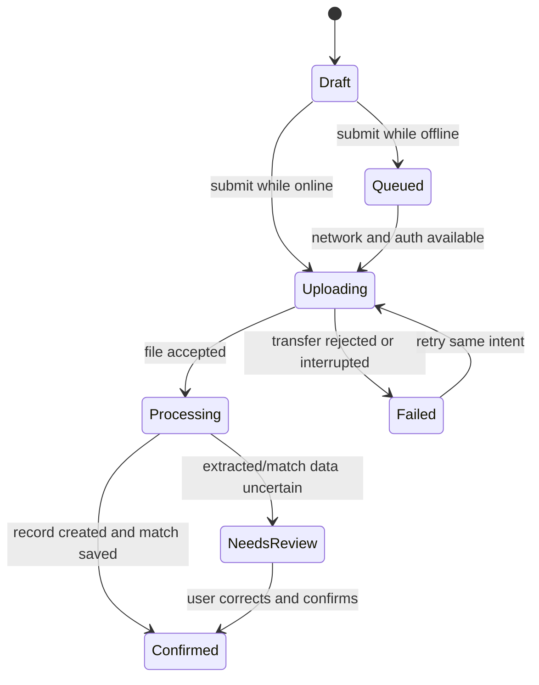

# Receipt Capture and Matching

A React Native (Expo) implementation of the receipt-capture brief: an employee with unreliable
connectivity photographs or picks a receipt, records the expense metadata, and matches it against a
seeded card transaction — without the app ever lying to them about whether the server actually has it.

The whole design turns on one sentence from the brief:

> submitted work must never tell the user "confirmed" merely because a local queue accepted it.

Everything below is downstream of taking that literally.

---

## Quick start

```bash
npm install
```

```bash
npm start
```

Then press `i` for the iOS simulator, `a` for Android, or `w` for web. Run the tests with:

```bash
npm test
```

```bash
npm run typecheck
```

There is no backend to configure. The server is a deterministic in-process fake
([`src/server/fake-server.ts`](src/server/fake-server.ts)) with a full failure-injection surface,
driven from the app's **Session & simulation** screen.

### A two-minute tour

1. Sign in as **Northwind**. Capture a receipt (any photo will do).
2. Go to **Settings → Offline**, capture another, and submit it. Watch the list: the device column
   says *Queued*, the server column says **Not received**. That gap is the point.
3. Back **Online**, pull to refresh. The server column becomes *Confirmed* only now.
4. Settings → **Inject a failure → Lost success response**. Submit a receipt: it fails. Set failure
   back to *None* and retry the same receipt — you get "Already on the server", and no duplicate.
5. Queue one offline, then **switch to Acme**. The queued receipt is gone from the list and cannot
   be sent. Switch back and it uploads.

---

## What this platform proves, and what it does not

The brief asks for this explicitly.

**What Expo + React Native genuinely demonstrates here**

- Real durable local persistence across app kill (SQLite via `expo-sqlite`), which is what makes
  the offline queue meaningful rather than decorative.
- Real OS-level secret storage (`expo-secure-store` → iOS Keychain / Android Keystore), which is a
  genuinely different security posture from `AsyncStorage`.
- Real permission flows and real camera/document picking on a device or simulator.
- The state machine, idempotency, and tenancy rules are plain TypeScript and are therefore
  exercised by the test suite exactly as they run in the app.

**What it does not prove**

- **No real network.** The "server" is an in-process object. Nothing here proves behaviour against
  TLS, real latency, proxies, captive portals, or an actual HTTP stack. What it *does* prove is that
  the client's state machine responds correctly to each *class* of outcome, which is the part a
  reviewer can actually interrogate.
- **No true background upload.** Uploads run while the app is alive. Real
  `URLSession`/`WorkManager` background transfer is in the extension list below, not implemented.
- **Web is a degraded preview.** There is no native SQLite or Keychain in the browser, so the app
  falls back to in-memory stores — and *says so in a banner* rather than pretending to be durable.
- **No OCR.** Extraction is a deterministic fake keyed off the storage key. That is a deliberate
  choice: a fake you can trigger on demand is more discussable than a flaky external service.

---

## Architecture

The dependency direction is strictly inward: UI → sync → data/server → domain. The domain layer has
no React, no Expo, no I/O, and no clock or randomness of its own — every time- or
randomness-dependent function takes it as a parameter. That is what makes the interesting rules
testable as pure functions.

| Path | Responsibility |
| --- | --- |
| [`src/domain/types.ts`](src/domain/types.ts) | The contract. Money, date semantics, the seven states, field provenance. |
| [`src/domain/state-machine.ts`](src/domain/state-machine.ts) | The brief's diagram, table-driven. Local events structurally cannot produce server states. |
| [`src/domain/money.ts`](src/domain/money.ts) | Integer minor units, per-currency exponents, string-based parsing (no floats). |
| [`src/domain/dates.ts`](src/domain/dates.ts) | `DateOnly` vs `Instant`, civil-date arithmetic, leap years. |
| [`src/domain/ids.ts`](src/domain/ids.ts) | Idempotency keys, submission fingerprints, rotation policy. |
| [`src/domain/validation.ts`](src/domain/validation.ts) | Untrusted-file checks by magic bytes; the production quarantine boundary. |
| [`src/domain/matching.ts`](src/domain/matching.ts) | Company-scoped candidate scoring and the one-receipt-per-transaction rule. |
| [`src/domain/confidence.ts`](src/domain/confidence.ts) | Confidence bands, generated caveats, auto-selection and ambiguity policy. |
| [`src/domain/barcode.ts`](src/domain/barcode.ts) | GS1-128 and fiscal-QR decoding. Pure; no camera dependency. |
| [`src/domain/extraction.ts`](src/domain/extraction.ts) | The only door through which an extraction may touch a draft. |
| [`src/notify/policy.ts`](src/notify/policy.ts) | Whether a transition is worth a notification, and what it may say. |
| [`src/notify/notifier.ts`](src/notify/notifier.ts) | The thin native shell around that policy. |
| [`src/ui/image-edit.ts`](src/ui/image-edit.ts) | Crop geometry and the re-encode pipeline. |
| [`src/data/store.ts`](src/data/store.ts) | The persistence interface — company-scoped *by signature*. |
| [`src/data/sqlite-store.ts`](src/data/sqlite-store.ts) · [`db.ts`](src/data/db.ts) | SQLite schema, migrations, row mapping. |
| [`src/data/session.ts`](src/data/session.ts) | Keychain-backed session, company switch, token rules. |
| [`src/server/`](src/server) | Deterministic fake backend, fake OCR, seed data. |
| [`src/sync/sync-engine.ts`](src/sync/sync-engine.ts) | Drains the queue. Where the invariants are enforced at runtime. |
| [`src/ui/`](src/ui) · [`src/app/`](src/app) | Screens and presentation. Thin on purpose. |

### The state machine



`Draft`, `Queued`, `Uploading` and `Failed` are **local**. `Processing`, `NeedsReview` and
`Confirmed` are **server** states, and the only function that can produce them —
`applyServerEvent()` — takes a server receipt id as a required argument and throws without one.
There is no code path that writes `state: 'confirmed'` from a local decision.

---

## The non-negotiable behaviors

| Requirement | Where it lives | How to see it |
| --- | --- | --- |
| Local and remote state are visibly different | [`src/ui/receipt-status.ts`](src/ui/receipt-status.ts) derives two independent columns; the server column reads `serverReceiptId`, never `state` | Every row and the detail screen show **On this device** and **On the server** side by side |
| Retrying does not duplicate | Stable `idempotencyKey` per draft + server dedupe on `(companyId, idempotencyKey)` | Inject *Lost success response*, then retry |
| Company switch cannot upload under the wrong company | Store is scoped by signature; `getTokenForCompany()` refuses a mismatch; server returns `COMPANY_MISMATCH` independently | Queue offline, switch company, try to sync |
| Explicit money/date semantics | Integer minor units + ISO-4217 exponent; `DateOnly` and `Instant` are separate types | Enter `1.999` in USD — rejected, not silently rounded. Enter a JPY amount — no decimals |
| Files are untrusted | [`validation.ts`](src/domain/validation.ts) sniffs magic bytes; the declared MIME type is a hint that loses when they disagree | See `PRODUCTION_QUARANTINE_BOUNDARY` in that file |
| Secrets are not in plaintext storage | `expo-secure-store` only; the token never enters SQLite and `getPublicSession()` cannot leak it | `signOut()` empties the secret store |

---

## Edge cases

Each of the brief's six cases is handled and, more importantly, **triggerable on demand** from
Settings — a failure path you cannot reproduce is one nobody has tested.

**1. Upload succeeds but the success response is lost.**
The fake server commits the record and *then* returns `TRANSFER_INTERRUPTED`, which is the only
honest model. The client cannot distinguish this from a real interruption, so it does the only safe
thing: retries with the same idempotency key. The server recognises the key and returns the original
receipt with `deduped: true`. The UI says "Already on the server". One record, one match.

**2. Auth expires while a background upload is running.**
The token is re-checked immediately before the request, not when the pass began. If it has lapsed,
the receipt is parked back in the queue with an explanatory message — never marked failed-forever,
never marked confirmed. `syncAll()` stops the whole pass on `AUTH_EXPIRED` rather than generating N
identical failures.

**3. App killed after queueing, relaunched under a different company.**
`companyId` is stamped on the draft at capture time and never rewritten. On relaunch under another
company the draft is invisible to every store query, and the sync engine skips it with
`COMPANY_CHANGED`. The detail screen explains *why* rather than showing an empty state. Switching
back makes it submittable again.

**4. A HEIC image is too large or unsupported.**
Rejected client-side by size and magic bytes before it ever enters the queue, and independently by
the server. Both rejections carry `retryable: false`, and `syncAll()` deliberately does not retry
those — retrying cannot make a file smaller. The user gets an actionable message instead of a
spinner.

**5. OCR returns after the user corrected the vendor and amount.**
Every extractable field carries a `FieldOrigin`, ordered `empty < ocr < barcode < user`. A writer
may only overwrite a field whose current origin ranks strictly lower than its own, so a human edit
is permanent while a barcode may still upgrade a field OCR guessed at. All automatic writes go
through one function, [`mergeExtraction`](src/domain/extraction.ts) — there is no path from the
camera or the server that writes a field directly.

Two rules inside it are worth naming, because both guard the 100x class of error: an amount with no
currency is refused outright, and a currency change is refused whenever it would *re-denominate* an
amount the incoming origin cannot overwrite. So a barcode reading "EUR" against a total the user
typed in dollars is rejected whole, rather than quietly restating their number in another currency.

The form marks a field `user` only if the person actually supplied it. Stamping all four on save —
the obvious shortcut — would record the currency picker's *default* as a human decision, locking an
unconsidered `USD` against correction forever.

**6. Two receipts matched to the same transaction.**
`Transaction.matchedReceiptId` holds at most one receipt. A second claim returns
`TRANSACTION_ALREADY_MATCHED` with `retryable: false`, and the match picker greys out and explains
blocked candidates. Re-claiming the *same* transaction from the *same* receipt is idempotent, so a
retry is never punished.

---

## Scope

**Core (Phase 1)** — capture via camera or library; metadata entry with real validation; durable
drafts; offline queue; the full state machine; idempotent retry; company boundary end to end;
seeded matching with conflict handling; secure session with switch/logout cleanup; deterministic
fake OCR feeding a NeedsReview path; failure injection for every modelled failure.

**Creative directions (Phase 2)** — four of the brief's six, chosen because they compose into one
story rather than four unrelated features: a barcode payload produces values → those values must
respect the provenance rules → which feed a confidence decision → which is what a notification
announces. The brief says plainly that *"more extensions do not produce a higher score by
themselves"*, so the two that did not fit that thread were left out.

- **Barcode / QR extraction** — real GS1-128 Application Identifiers and base64/TLV fiscal-invoice
  QR, not a fake. Both formats are public and fully deterministic, which satisfies the brief's
  preference for "a deterministic fake … over a fragile external demo" while being genuinely
  correct rather than theatre.
- **Receipt cropping and compression** — normalised crop rectangle, 1600px longest edge, always
  re-encoded to JPEG so an unsupported HEIC never reaches the server at all.
- **Match confidence** — bands, generated caveats, an auto-selection threshold, and an ambiguity
  guard that refuses to pre-select anything when two candidates are too close to call.
- **Push completion** — a local notification when the *server* confirms, with the amount
  deliberately withheld from the body.
- **Accessibility** — the local/remote status pair is grouped so it reads as one sentence rather
  than two disconnected words; choices announce their selected state; crop handles are
  `adjustable` so they work without a drag gesture.

**Deliberately not implemented:** a web review console; resumable/chunked upload; true OS
background transfer; conflict handling across two devices; Detox/E2E; telemetry and crash
reporting; pre-signed upload URLs.

**What I would do next, in order:** (1) real background upload, because it is the one gap that
changes the state machine rather than decorating it — a transfer that outlives the process needs a
reconciliation pass on launch; (2) a `GET /receipts?since=` reconciliation endpoint so a client that
missed responses can resynchronise rather than retrying blind; (3) Detox coverage of the
offline → switch-company → back path, which is the sequence most likely to regress.

---

## Expected discussion

### The local/remote state machine and source of truth

There are two state machines, not one, and conflating them is the bug the brief is testing for.

The **device** owns `draft → queued → uploading → failed`. The **server** owns
`processing → needsReview → confirmed`. They meet at exactly one function, `applyServerEvent()`,
which requires a `serverReceiptId` and throws `UnprovenServerStateError` without it. `applyLocalEvent()`'s
transition table contains no server state at all, so "local queue accepted it" cannot become
"confirmed" even by accident.

**The server is the source of truth for business facts** (does a record exist, is a match saved).
**The device is the source of truth for intent** (what the user typed, what they want matched). When
they disagree about a business fact, the server wins and we overwrite local state. When they
disagree about *intent* — a late OCR result versus a human correction — the human wins, which is why
provenance is tracked per field.

The UI never renders a single merged status. It renders both, always, and the server column reads
`serverReceiptId` rather than `state`, so it is structurally incapable of showing confirmation the
server did not give.

### Idempotency key lifetime and retry behavior

The key is minted when the draft is created and is **stable for the lifetime of one logical
submission**. Every retry reuses it. The server keys on `(companyId, idempotencyKey)` — company-scoped
so a key cannot be replayed across tenants.

The interesting decision is when to *rotate*. `shouldRotateIdempotencyKey()` compares a fingerprint
of the submission's substance: file, vendor, amount, currency, transaction date, match target.
Notes are excluded — editing a note is not a new submission. If the substance changes, the key
rotates, because otherwise the server would dedupe the user's correction against the original record
and silently discard it. That failure mode is much worse than a duplicate, because it is invisible.

Server-side the mapping is retained for `IDEMPOTENCY_KEY_TTL_HOURS` (24h here). Retention must
exceed the longest plausible offline window, or a receipt queued on a plane becomes a duplicate on
landing. A key the server has never seen is treated as a new submission; an expired one is also
treated as new, which is why the TTL has to be generous.

Retries distinguish **transient** from **permanent** via `retryable`. Transient failures
(interrupted transfer, 500, expired auth) are retried; permanent ones (too large, unsupported type,
transaction already matched) are not retried automatically, because no amount of retrying changes
the answer and the battery cost is real.

### Secure local storage and cleanup

The auth token goes to `expo-secure-store` (Keychain / Keystore) with
`WHEN_UNLOCKED_THIS_DEVICE_ONLY`, so it is unavailable before first unlock and does not migrate to a
new device via backup restore. It never touches SQLite or `AsyncStorage`. The split is deliberate
and visible in the code: `SessionManager` holds the secret, and `getPublicSession()` returns an
object with no `token` property so the UI layer cannot leak it into a log or a render tree.

Receipt *images* live in the app sandbox, not in secure storage — they are too large for the
Keychain, and the OS sandbox plus file-level encryption is the right tier for them.

On company switch the old token is deleted **before** the new one is written, so there is no window
in which two tenants' credentials are simultaneously live. Sign-out deletes it outright; the tests
assert the secret store is then empty.

`restore()` validates a rehydrated blob's `expiresAt` as strictly as its token, and destroys the
stored secret if it is missing or malformed. That check was absent in an earlier revision, and the
consequence was an immortal session: with no `expiresAt`, `undefined <= now` is false, so the token
was handed out indefinitely. It was found by mutation-testing the session suite rather than by the
suite itself, which is recorded in the worklog because it is the most instructive failure here.

What is **not** done: receipt images are not purged on sign-out, and a production build would want
that plus certificate pinning and a jailbreak/root posture decision.

### File transfer versus business-record creation

These are two different events and the brief is right that conflating them is where duplicates come
from. Moving bytes is idempotent and cheap to repeat; creating an expense record is neither.

This implementation keeps them distinguishable: the file is addressed by a server-generated
`storageKey` that is derived from `(companyId, localId, mime)` and deliberately **never** embeds the
client's filename, and record creation is guarded by the idempotency key. A retry re-sends bytes
(harmless) and re-asserts the same record (deduped).

In production I would split them properly: request a pre-signed URL, `PUT` the bytes directly to
object storage — retryable and resumable without touching the API — and then make a *separate*,
idempotent call that says "create a receipt record from the object at this key". That way a flaky
transfer never risks a duplicate business record, and the expensive part is a small JSON call rather
than a 4 MB upload.

### Permissions, lifecycle, and platform-specific tradeoffs

Camera and photo-library permissions are declared in [`app.json`](app.json) with real usage strings
(iOS kills the app at the prompt without them). The app asks at the point of use and handles denial
with a specific message rather than a dead button.

**Lifecycle** is the honest weak point. Uploads run in the foreground. If the app is backgrounded
mid-upload, the request dies and the receipt returns to the queue — safe, thanks to idempotency, but
not *good*. Real background transfer means `URLSession` background sessions on iOS and `WorkManager`
on Android, which are genuinely different models: iOS hands completion to a relaunched app delegate,
so the reconciliation-on-launch pass becomes mandatory rather than optional.

**Platform differences that bite:** Android `content://` URIs can be revoked when the granting
activity dies, which is exactly why files are copied into the sandbox before anything is promised.
HEIC is the iOS default and many backends reject it, so it is validated explicitly rather than
discovered at upload time. Keychain and Keystore have different availability semantics on a locked
device.

### What works only in this simulator or hosting choice

- The server is in-process. Restarting the app resets server state; there is no cross-device story.
- `setNetworkMode` is a flag on that object, not real airplane mode. It proves the *client's*
  branching, not radio behaviour.
- Web has no SQLite or Keychain: the app degrades to in-memory stores and shows a banner saying so.
- Failure injection is a demo affordance. In production these paths would be exercised by fault
  injection in integration tests, not a settings screen.
- OCR is a hash of the storage key. Same image, same result, every time — which is the property that
  makes the NeedsReview path demonstrable.
- **Push completion is a LOCAL notification, not remote push.** Remote push needs a push service, a
  device-token registry, and a server that can reach it — none of which an in-process fake can
  honestly provide. What this does demonstrate is the real client-side behaviour: permission timing,
  deep-link validation, collapse keys, and lock-screen privacy. What it does *not* demonstrate is the
  case that actually matters in production — a completion arriving while the app is dead, which is
  exactly what makes a reconciliation-on-launch pass mandatory rather than optional.
- Barcode *decoding* is real and tested; barcode *scanning* depends on the device camera and is only
  exercised on a simulator or handset.

### The testing split

**Pure logic** is where the density is, because that is where the rules live and where tests are
fast and deterministic. Money parsing, calendar arithmetic, magic-byte sniffing, match scoring,
idempotency rotation, and the state-machine transition tables are all pure functions tested directly.
The state-machine tests build the full (state × event) cross-product so a future event cannot be
added without being covered — including the exhaustive assertion that no local event can ever
produce a server state.

**Integration** is the sync engine against a real store, real session, and the fake server with an
injected clock. This is where the edge cases are proven end to end: lost response, auth expiry,
company switch, permanent-vs-transient rejection, double match.

**Components** are thin by design, so they get little direct testing — the logic they would test has
been pushed into `receipt-status.ts`, which *is* tested. I would rather have a well-tested pure
function and a dumb renderer than a component test asserting on a rendered string.

**E2E** is absent. Detox is the right tool and the offline → switch-company → back sequence is the
first thing I would cover.

The test suites were additionally **mutation-audited**: invariants were deliberately broken in the
implementation to confirm the tests actually fail. A test that passes against a broken
implementation is worse than no test, because it manufactures confidence.

That practice earned its keep twice. In Phase 1 a 645-test green suite survived six sabotages of the
state machine — all of them *field-blanking*, because the tests only asserted what a transition
changes and never what it must preserve. In Phase 2 the five highest-value invariants were each
broken deliberately and every one was caught:

| Sabotage | Tests that failed |
| --- | --- |
| Provenance precedence disabled | 23 |
| Blocked candidates made auto-selectable | 2 |
| Ambiguity guard disabled | 4 |
| GS1 GTIN treated as variable-length | 15 |
| Amount leaked into a notification body | 6 |

### How AI and tooling handled — or missed — native and failure-path complexity

See the worklog below, but the short version:

AI was strong at **breadth against a fixed contract** — once the domain types and state machine were
pinned, parallel agents produced money handling, calendar arithmetic, magic-byte sniffing, and the
fake server to spec, with dense edge-case tests.

It was weak at exactly the places the brief targets. **Native API surfaces** were the worst: the
`expo-file-system` API changed to `File`/`Paths`, and the correct move was to interrogate the
compiler and the installed type definitions rather than trust recall. **Cross-module assumptions**
were the second failure: interfaces I assumed for the fake server did not exist, and only the
compiler caught it. And the failure paths needed to be *specified* — asking for "handle errors"
produces optimistic code, whereas naming "the success response is lost, and the record was created
anyway" produces the right design.

---

## Testing

```bash
npm test
```

```bash
npm run typecheck
```

```bash
npm run lint
```

1033 tests across 19 suites. The split is deliberate — see
[The testing split](#the-testing-split) above.

| Suite | Covers |
| --- | --- |
| `domain/__tests__/money` | Minor-unit parsing, per-currency exponents, the float traps |
| `domain/__tests__/dates` | Calendar arithmetic, leap years, date-only vs instant |
| `domain/__tests__/validation` | Magic bytes, size and type rejection, unsafe names |
| `domain/__tests__/matching` | Scoring, company isolation, double-match refusal |
| `domain/__tests__/ids` | Fingerprints and idempotency-key rotation |
| `domain/__tests__/state-machine` | Every transition, plus the full (state x event) cross-product |
| `domain/__tests__/state-machine-preservation` | What a transition must *not* touch |
| `domain/__tests__/regression` | Defects found by adversarial review (see worklog) |
| `data/__tests__/persistence` | Tenancy in the store; token rules in the session |
| `server/__tests__/*` | Idempotency, company mismatch, OCR determinism |
| `sync/__tests__/sync-engine` | All six edge cases, end to end |
| `domain/__tests__/barcode` | GS1 fixed/variable AIs, hostile TLV, decimal-vs-exponent conflict |
| `domain/__tests__/confidence` | Band boundaries, ambiguity guard, generated caveats |
| `domain/__tests__/extraction` | The full 4x4 provenance grid, and the re-denomination rules |
| `domain/__tests__/user-provenance` | That only what a person typed is marked as theirs |
| `notify/__tests__/policy` | Triggers, and that no body ever leaks an amount |
| `notify/__tests__/notifier` | Deep-link validation against open-redirect payloads |
| `ui/__tests__/image-edit` | Crop geometry, including degenerate and out-of-bounds rects |

---

# AI and tooling worklog

Recorded in the format of the provided `AI-WORKLOG.md`. This project was built by a developer
working through an AI coding agent, so the worklog is not optional here — the agent shaped the
build materially, including in ways that were wrong.

## Tool inventory

| Tool/model | Version or access mode, if known | Purpose | How invoked |
| --- | --- | --- | --- |
| Claude Opus 5 | Claude Code, desktop app | Implementation, test authoring, adversarial review | Agent (interactive), with a workflow orchestrator for parallel subagents |
| Claude subagents | Same model, spawned by the orchestrator | Parallel module implementation; independent review; mutation auditing | Agent (programmatic fan-out) |
| `pypdf` 6.18.1 | Throwaway Python venv | Reading the PDF brief | CLI |
| TypeScript 6.0 (`tsc --noEmit`) | Project-local, `strict` | Type verification, and as an API oracle for unfamiliar SDK surfaces | CLI |
| Jest 29 + `jest-expo` 57 | Project-local | Test harness | CLI |
| ESLint 9 + `eslint-config-expo` | Project-local | Lint | CLI |
| Metro / Expo CLI | SDK 57 | Bundle verification, typed-route generation | CLI |

## Workflow

- **How I divided work between myself and tools.** I wrote the domain contract
  (`types.ts`) and the state machine by hand, first and alone. Everything else depends on them, and
  interface drift is the dominant failure mode when several agents write code in parallel — so the
  contract had to be frozen before any fan-out. Agents then implemented modules that depended only
  on that frozen contract. I wrote the persistence layer, sync engine, and all UI myself, because
  those are where the cross-cutting decisions live.
- **Agent/task structure.** Two fan-outs. The first: six implementation agents (money, dates,
  validation, matching, ids, fake server), each writing its module plus colocated tests against an
  exact export signature, followed by eighteen reviewers — three per module, with *different*
  lenses (brief-invariant compliance, raw correctness, test quality). The lens diversity mattered:
  the money bugs were found by the correctness lens, the hollow tests by the test-quality lens, and
  neither would have found the other's. The second fan-out: three test-suite agents, each followed
  by a mutation auditor instructed to deliberately break the implementation and confirm the suite
  went red.
- **Test, evaluation, lint, type, security, or deployment harnesses.** `tsc --noEmit` under
  `strict`; Jest; ESLint; a real Metro bundle to prove the app still builds; and an explicit
  mutation-testing pass, which turned out to be the highest-yield harness of the set.
- **Context/reference material supplied to tools.** The brief verbatim — including the six
  non-negotiables and six edge cases in full, in every agent prompt — plus the frozen `types.ts`
  and `state-machine.ts`, and a precise export signature for each module. Agents were told not to
  edit the contract, and to report a suspected defect in it rather than work around it silently.

## Consequential interactions

| Goal or prompt summary | Tool/agent | Output used | Assumption introduced | How I verified it | What I changed/rejected |
| --- | --- | --- | --- | --- | --- |
| Read the PDF brief | `pypdf` in a venv | Full text of all four pages | That text extraction captured the page-2 state diagram | The diagram is vector text, so every transition label came through; I reconstructed it and checked it against the prose | Nothing — but had it been a raster image I would have needed page rendering, which the machine could not do |
| Implement six domain modules in parallel against a frozen contract | Workflow, 6 agents + 18 reviewers | All six modules and their tests | That agents conform to the signatures I specified | `tsc --noEmit`, 385 passing tests, then three independent review lenses per module | Fixed raw control bytes in a regex; fixed four real defects the reviewers found (below) |
| Build the deterministic fake server | Agent | `fake-server.ts`, `ocr.ts`, `seed.ts` | **Mine, and wrong:** that it would expose `seedTransaction`, `listTransactionsUnchecked`, `expireTokensForCompany` | `tsc` failed on all three | Rewrote the app context against the real API — which was better, because it forced transactions through the *authenticated* endpoint |
| Determine the `expo-file-system` API | `tsc` as an oracle | `File` / `Paths` / `Directory` | That recalled API shape was current — it was not | Wrote a throwaway probe file and let the compiler enumerate the members | Rewrote the intake layer; `bytes()` is async, which the compiler caught |
| Write behavioural tests for the invariants | Workflow, 3 agents + 3 mutation auditors | `state-machine`, `persistence`, `sync-engine` suites | That a green suite means a covered invariant | Mutation testing: deliberately broke the implementation and re-ran | Added a whole preservation suite after the audit showed 6 of 18 sabotages went undetected |
| Build the Phase 2 modules against an extended contract | Workflow, 4 agents | barcode, confidence, extraction, notification policy | That agents conform to specified signatures, as in Phase 1 | `tsc`, 273 new tests, then my own mutation pass | Fixed raw control bytes in six files; adopted all four modules unchanged otherwise |
| Mutation-audit the Phase 2 modules | (planned: 4 agents; **all four failed on a usage limit**) | Nothing — the phase produced no output | — | I ran the five highest-value mutations by hand instead | Nothing skipped; the audit happened, just not the way it was scheduled |
| Decide barcode strategy | My call, not the agent's | Real GS1-128 + fiscal-QR parsing | That implementing public formats beats inventing a fake | Both are fully specified and deterministic, so they are testable to the same standard | Rejected the "deterministic fake decoder" reading of the brief as the weaker option |

## Failures and corrections

- **Incorrect or fabricated suggestion.** I wrote the app context against three `FakeServer`
  methods that did not exist and that I had never specified. Nothing but the type-checker caught
  it. This is the characteristic failure of parallel agent work: the *agent* honoured its contract,
  and I was the one who invented an interface. The lesson is that a frozen contract only helps for
  the modules it actually covers.
- **Overly broad/generated scope I removed.** A test that asserted on the *prose of a doc comment*
  (grepping the source for the words "LOSSY" and "NEVER USE IT FOR"). It was clever and it was
  documentation-policing: rewording a comment would break the build for no behavioural gain. Also
  removed two tautological tests — one that set `process.env.TZ` inside Jest, where it is a Proxy
  over a copied object so the write never reaches ICU and every assertion collapsed to
  `f(x) === f(x)`; and one claiming to prove DST-independence for string math that has no DST
  exposure. Both were replaced with a single structural assertion that the module contains no
  `Date` or `Intl` at all, which I verified *does* fail when `new Date` is reintroduced.
- **Security/correctness issues I found in generated work.** Four real defects, all in code with a
  green test suite. `parseAmountToMinorUnits('¥500', 'USD')` returned `USD 500.00` — a 100x error —
  because the leading-symbol strip was unguarded, while the structurally identical `'EUR19.99'` in a
  USD field was correctly rejected; the two paths disagreed. `'0,750'` in OMR parsed as `OMR 750.000`,
  a 1000x error, because a three-digit group after a comma is a valid thousands group *and* a valid
  decimal comma in a three-decimal currency. `formatMinorUnits(1e21)` returned the string `'1e+.21'`,
  because `Number.isInteger(1e21)` is true and the digit surgery sliced exponential notation. And
  HEIC/HEIF label drift produced two storage keys for one draft, breaking a determinism guarantee
  the function documented about itself. I reproduced every one before fixing it, and pinned all four
  in `regression.test.ts`.
- **Tool loop or agent handoff that did not work.** `brew install poppler` failed because Homebrew
  needs Xcode Command Line Tools, which needs a GUI installer; I fell back to a `pypdf` venv. More
  significantly, running the test suite *while* the mutation auditors were working produced
  meaningless output — I saw "3 failures", then "15 failures", then a `serverReceiptId` of
  `"assumed-ok"` that exists nowhere in the codebase. I had to wait for a 90-second window of
  filesystem stability before any test result meant anything, and then verify by hand that every
  mutation had been reverted rather than trust the agents' self-reports. One had been: a sabotage of
  `encodeURIComponent` in the idempotency fingerprint, which would have let a vendor named
  `x&vendor=y` forge another field.
- **The worst bug in the project was mine, and only mutation testing found it.**
  `SessionManager.restore()` validated the token, company and user on a rehydrated blob but never
  `expiresAt`. A blob missing that field — a partial write, or an older schema — produced a session
  where `undefined <= now` is false, so it **never expired**. I confirmed it directly: a restored
  undated session still handed out its bearer token for a request dated 2099. A second defect in the
  same file meant `emit()` computed `expired` with no clock at all, so every payload pushed to a
  subscriber claimed the session was live, including one that had lapsed in the year 2000. Neither
  was caught by 46 passing tests written specifically for that file; both were found by an auditor
  sabotaging the code to see whether anything screamed. The fix injects a clock and validates
  `expiresAt` as strictly as the token, with tests that I verified fail when the guard is removed.
- **The same defect class recurred, which makes it a tendency rather than an incident.** In both
  phases, agents emitted regexes and string literals containing *raw* control characters instead of
  escape sequences — `\x00`, `\x1F`, `\x7F`, and in the barcode parser the GS1 separator itself as a
  literal `0x1D`. The code is functionally correct every time, which is exactly why it survives
  review: the characters are invisible. What it costs is real, though — the files become binary to
  git, grep and diff, so `grep -n "^export"` silently returns nothing and a code review shows
  "Binary files differ". Ten files were affected across the two phases. I now scan for it explicitly
  rather than trusting that a green suite means a clean file.
- **A bug I introduced in a screen, caught by lint rather than by me.** The crop screen built its
  PanResponders inside a `useMemo` that read `rectRef.current` during render. `react-hooks/refs`
  flagged it, correctly: reading a ref while rendering can silently miss an update. Restructured onto
  React Native's own responder props so every ref access happens inside an event handler, and lifted
  the gesture arithmetic into a pure, tested function while I was there.
- **A provenance bug that would have quietly defeated edge case 5 from the other direction.** The
  capture form stamped all four fields as `user` on every save. Marking fields the person *did* fill
  is right; marking the currency picker's untouched default is not — it records `USD` as a human
  decision and locks it against any later correction. Fixed by tracking whether the picker was
  actually used, and pinned with tests that prove an extraction can still fill a blank the user left
  while still being refused when it would re-denominate a number they typed.
- **My own test caught my own bug.** In the crop geometry, clamping only the far edge was not
  enough: an origin landing exactly on the boundary leaves zero room, and the one-pixel minimum then
  pushed the rectangle back out of bounds — the precise out-of-range crop the function exists to
  prevent. Found by the degenerate-rect cases, not by reading the code.
- **How the harness/tests exposed problems.** Mutation testing was worth more than every other
  check combined. A 645-test green suite survived six deliberate sabotages of the state machine —
  all of them *field-blanking*, because the tests only ever asserted what a transition changes,
  never what it must preserve. Blanking `provenance` would have silently turned a human correction
  back into something a late OCR result could overwrite, which is exactly the brief's edge case 5,
  passing tests and all. Across all three suites the auditors tried 60+ mutations; the ones that
  survived clustered almost entirely around *preservation* and *negative* properties — the things
  a test author does not think to assert because nothing draws attention to them.

## Ownership check

- **Code or design I would explain differently now.** The seven states are one enum, following the
  brief's diagram. Having built it, two orthogonal fields — a local state and a nullable server
  state — would model the truth more directly. `isServerConfirmed()` exists precisely because one
  enum cannot express "the device thinks it is done and the server has never heard of it."
- **Area I understand least and how I would validate it before production.** The new
  `expo-file-system` `File` API against Android `content://` URIs — specifically whether `bytes()`
  can be read before the provider materialises the file, and what happens when the granting activity
  dies mid-read. The degraded path (`magicBytes === null`) exists because of that uncertainty. I
  would validate it on real devices across several storage providers (Drive, Photos, Files, a
  third-party scanner) before trusting it, and until then the server's own sniffing is what actually
  protects us.
- **Licenses/provenance or generated-asset concerns.** The project starts from Expo's default
  template (its `LICENSE` is retained). No third-party source was copied in; the generated code is
  original to this session. `seed.ts` merchant names are invented. No AI-generated images or other
  assets are used.
- **Sensitive information intentionally excluded from tools.** None was involved. There are no real
  credentials, no real card data, and no real receipts — every transaction, company and user is
  synthetic and checked into the repo. The fake server's tokens are `tok_1`, `tok_2`, and so on.
- **Where AI accelerated the work.** Breadth against a fixed contract. Six modules with dense
  edge-case tests, written in parallel, is many hours of work compressed — but only because the
  contract was frozen first. The adversarial review was the other real win: the four money and
  storage-key defects were in code I would probably have accepted on reading, because it was
  well-structured, well-commented, and had passing tests.
- **Where AI increased review or cleanup cost.** Four places. Native API surfaces, where recalled
  shapes were confidently wrong and the compiler was the only reliable oracle — `expo-file-system`
  moved to a `File`/`Paths` API and `bytes()` became async; `accessibilityRole="status"` does not
  exist in React Native. Cross-module assumptions, where my own invented interface cost a rewrite.
  Invisible-character emission, which recurred across two independent workflows. And
  *plausible-but-hollow tests* — the most expensive category, because a hollow test is worse than a
  missing one: it looks like coverage. Verifying the tests cost more than writing them, and was the
  single highest-value thing I did.
- **What I would tell someone running agents on work like this.** Freeze the contract by hand before
  any fan-out, because interface drift is the dominant failure mode and it is *your* invented
  interface that will drift, not theirs. Then budget as much time for adversarially verifying the
  output as for producing it. Every defect that mattered here — the 100x currency bug, the immortal
  session, the six field-blanking sabotages — was found by something actively trying to break the
  code, never by reading it. Reading it is how they survived review in the first place.

